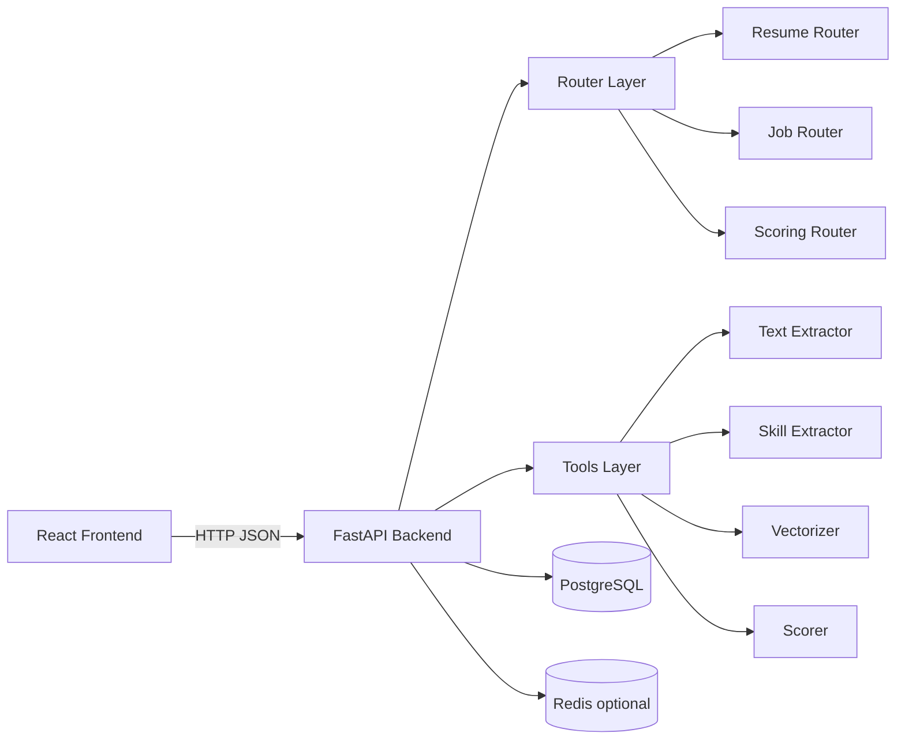

# Tesseract: Smart Resume Matching Engine

An explainable, deterministic resume-to-job matching platform with a FastAPI backend, a React frontend, and production-ready Docker deployment.

If you only read one line: this project turns raw resumes and job descriptions into transparent, auditable fit scores and ranked shortlists.

---

## Start Here: Choose Your Journey

Pick your path and jump in:

- I want to run it now in 5 minutes: [Quick Launch](#quick-launch-5-minutes)
- I want to understand the product vision: [What and Why](#what-and-why)
- I want to understand the internals deeply: [How It Works](#how-it-works)
- I want API contracts and endpoints: [API Surface](#api-surface-implemented)
- I want deployment and operations: [Deployment](#deployment)
- I want to contribute safely: [Testing and Developer Workflow](#testing-and-developer-workflow)

---

## Quick Launch (5 Minutes)

```bash
docker compose up --build
```

Open:
- UI: `http://localhost:3000`
- API health: `http://localhost:8000/health`

Then do this mini tour:
1. Upload a resume in `Resumes`.
2. Create a job in `Jobs`.
3. Score in `Match`.
4. Rank all candidates in `Rankings`.
5. Move candidates through stages in `Pipeline`.

If everything works, you will have a complete ingest -> score -> rank -> pipeline loop running locally.

---

## What and Why

### What this project is

Tesseract is a recruiting intelligence layer that does four core jobs:
1. Ingest resumes (`PDF`, `DOCX`, `TXT`) and extract text + skills + embeddings.
2. Ingest job descriptions and enrich required skills through extraction.
3. Compute weighted fit scores with full component transparency.
4. Enable practical recruiter workflows (history, pipeline stages, notes, exports).

### Why this exists

Most systems provide one opaque "match score." Tesseract is designed to be explainable by default:
- clear weighting model
- visible breakdown per score component
- matched and missing skill lists
- deterministic suggestions and gap reports

Strategically, it also prioritizes:
- self-hosting
- low-cost operation
- no hard dependency on external LLM APIs for core scoring

---

## Feature Snapshot

### Resume management
- `POST /api/resumes/upload` single upload
- `POST /api/resumes/upload/bulk` bulk upload
- list/get/delete resumes
- update `status` and `notes` via `PATCH /api/resumes/{resume_id}`

### Job management
- create/list/get/delete jobs
- required skills are merged with extracted skills from the JD text

### Scoring and ranking
- `POST /api/score` single candidate scoring
- `POST /api/score/batch` multi-candidate ranking
- `GET /api/score/history` persisted scoring timeline
- `GET /api/score/export/csv` export rankings

### Workflow
- dashboard analytics: `/api/stats`
- pipeline view data: `/api/pipeline`
- configurable scoring profiles: `/api/scoring-profiles`
- blind mode in frontend to mask identity signals

---

## How It Works

### Architecture at a glance



### Code map

- Backend entry and system endpoints: `app/main.py`
- Routers:
	- resumes: `app/routers/resumes.py`
	- jobs: `app/routers/jobs.py`
	- scoring: `app/routers/scoring.py`
- Data models: `app/models/*`
- Settings and env handling: `app/config.py`
- Core tools:
	- extraction: `tools/text_extractor.py`
	- embeddings: `tools/vectorizer.py`
	- skills: `tools/skill_extractor.py`
	- scoring: `tools/scorer.py`
	- DB operations: `tools/db_handler.py`
	- caching utilities: `tools/cache_handler.py`
- Frontend routes: `frontend/src/App.tsx`
- Frontend pages: `frontend/src/pages/*`
- Frontend API client: `frontend/src/api.ts`

---

## Scoring Engine Deep Dive

Main scorer: `tools/scorer.py:compute_fit_score`

Default weighting:
- semantic: `0.40`
- skills: `0.35`
- experience: `0.15`
- education: `0.10`

Formula:

```text
fit_score = clamp(
	semantic_score * w_semantic
	+ skills_score * w_skills
	+ experience_score * w_experience
	+ education_score * w_education,
	0, 100
)
```

How each component is computed:
- semantic: cosine similarity between resume/JD embeddings
- skills:
	- exact matches get full credit
	- fuzzy matches use Dice coefficient on bigrams for partial credit tiers
	- preferred skills add up to +5 bonus
- experience: neutral if missing, proportional if below target, boosted if above target
- education: degree hierarchy + field match with STEM-relatedness handling

Outputs include:
- overall score
- per-component breakdown
- matched/missing/partially matched skills
- deterministic suggestions
- natural-language explanation
- gap report entries

<details>
<summary>Example explanation style produced by scorer</summary>

"Candidate X is a strong match for Backend Engineer with an overall fit score of 78%. Key matching skills include Python, FastAPI, Docker. Skills alignment is particularly strong at 85%. Primary gaps: Kubernetes, Redis."

</details>

---

## API Surface (Implemented)

### System
- `GET /health`
- `GET /api/stats`
- `GET /api/pipeline`

### Resumes
- `POST /api/resumes/upload`
- `POST /api/resumes/upload/bulk`
- `GET /api/resumes`
- `GET /api/resumes/{resume_id}`
- `PATCH /api/resumes/{resume_id}`
- `DELETE /api/resumes/{resume_id}`

### Jobs
- `POST /api/jobs`
- `GET /api/jobs`
- `GET /api/jobs/{job_id}`
- `DELETE /api/jobs/{job_id}`

### Scoring
- `POST /api/score`
- `POST /api/score/batch`
- `GET /api/score/history`
- `GET /api/score/export/csv`

### Scoring profiles
- `POST /api/scoring-profiles`
- `GET /api/scoring-profiles`
- `GET /api/scoring-profiles/{profile_id}`
- `DELETE /api/scoring-profiles/{profile_id}`

---

## Data Model

Defined in `init.sql` and mirrored in `tools/db_handler.py`:

- `resumes`
	- includes workflow fields `status` and `notes`
- `jobs`
- `score_history`
	- stores score snapshots with breakdown, matched/missing skills, explanation, gap report
- `scoring_profiles`
	- stores custom weight sets

Indexing includes:
- B-tree indexes for common list/sort access
- GIN indexes for JSONB skill arrays
- score history indexes for frequent audit queries

---

## Frontend Experience

The UI is intentionally visual and action-oriented:
- `Dashboard`: health and trend snapshot
- `Resumes`: single and bulk upload, status and notes updates
- `Jobs`: JD creation and skills management
- `Match`: 1:1 and batch scoring
- `Rankings`: ranked results, candidate comparison, CSV export
- `Pipeline`: drag-and-drop candidate stages

Stack:
- React 19, TypeScript, Vite
- Framer Motion
- Recharts
- Axios

---

## Setup and Run Modes

### Option A: Docker (recommended)

```bash
docker compose up --build
```

Service endpoints:
- frontend: `http://localhost:3000`
- backend: `http://localhost:8000`
- postgres host port: `5433`
- redis host port: `6380`

### Option B: Manual local run

Prerequisites:
- Python 3.13+
- Node.js 20+
- PostgreSQL 16
- Redis 7 (optional)

Backend:

```bash
pip install -r requirements.txt
copy .env.example .env
uvicorn app.main:app --reload --host 0.0.0.0 --port 8000
```

Frontend:

```bash
cd frontend
npm install
npm run dev
```

Set API target if needed:
- `VITE_API_URL=http://localhost:8000`

Important manual mode note:
- API startup does not automatically call `init_tables()`.
- Initialize schema using `init.sql` before hitting write endpoints.

---

## Environment Configuration

Reference template: `.env.example`

Main env groups:
- Postgres: `POSTGRES_*` or `DATABASE_URL`
- Redis: `REDIS_*` or `REDIS_URL`
- model: `EMBEDDING_MODEL`, `EMBEDDING_DIM`
- scoring weights: `WEIGHT_SEMANTIC`, `WEIGHT_SKILLS`, `WEIGHT_EXPERIENCE`, `WEIGHT_EDUCATION`
- app runtime: `APP_HOST`, `APP_PORT`, `APP_ENV`, `LOG_LEVEL`

Constraint:
- scoring weights must sum to `1.0` (asserted in `app/config.py`).

---

## Testing and Developer Workflow

Tests live in `tests/` and cover:
- extractor behavior
- skill extraction
- vectorizer behavior
- scorer behavior
- DB handlers
- cache handlers
- full E2E pipeline

Run all:

```bash
pytest -v
```

Run only E2E:

```bash
pytest tests/test_e2e_integration.py -v
```

E2E target override:
- `E2E_BASE_URL` (default: `http://localhost:8000`)

---

## Deployment

### Containers and infra
- backend image: `Dockerfile.backend`
	- CPU-only PyTorch
	- model pre-download at build time
- frontend image: `Dockerfile.frontend`
	- Vite build stage + Nginx serve stage
- compose orchestration: `docker-compose.yml`

### Free-tier cloud path
See `DEPLOY.md` for full runbook:
- frontend: Vercel
- backend: Render
- database: Neon
- cache: Upstash (optional)

---

## Strengths and Current Gaps

### Strengths
- explainable and auditable scoring
- deterministic core pipeline
- self-hosted architecture
- practical recruiter workflow support

### Current gaps
- no built-in auth/RBAC yet
- Redis helpers exist but router-level cache usage is still limited
- OCR is not fully implemented end-to-end (fallback placeholder path)
- manual mode requires explicit schema setup

---

## Repository Map

```text
app/                      FastAPI app, routers, models, config
tools/                    Extraction, embeddings, scoring, DB/cache handlers
frontend/                 React app (pages, components, API client)
tests/                    Unit and E2E tests
architecture/             SOP documents per subsystem
Dockerfile.backend        Backend image build
Dockerfile.frontend       Frontend image build
docker-compose.yml        Full local stack
init.sql                  Schema and indexes
DEPLOY.md                 Free-tier cloud deployment guide
competitive_analysis.md   Product positioning and market context
```

---

## Interactive Mission: Validate the Full Loop

Use this as a final confidence check after startup:

1. Upload 2 resumes (`Resumes`).
2. Create 1 backend role (`Jobs`).
3. Run batch scoring (`Match` or `Rankings`).
4. Export CSV (`Rankings`).
5. Move top candidate from `new` -> `screening` in `Pipeline`.
6. Check `/api/score/history` to confirm persisted audit trail.

If all six pass, the platform is working as designed.

